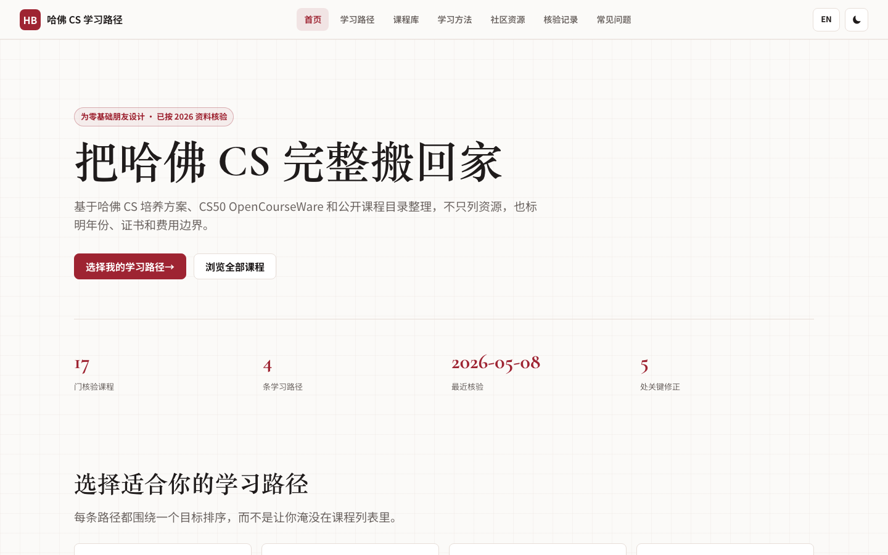
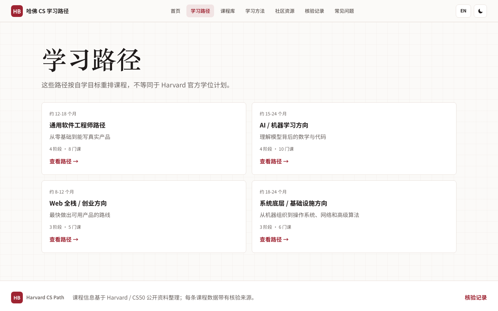
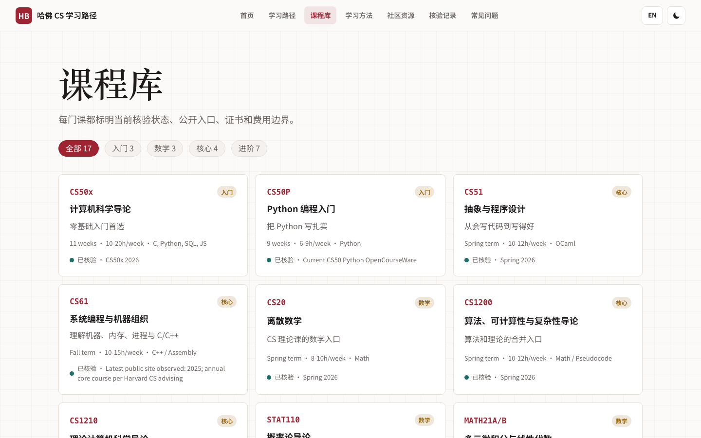
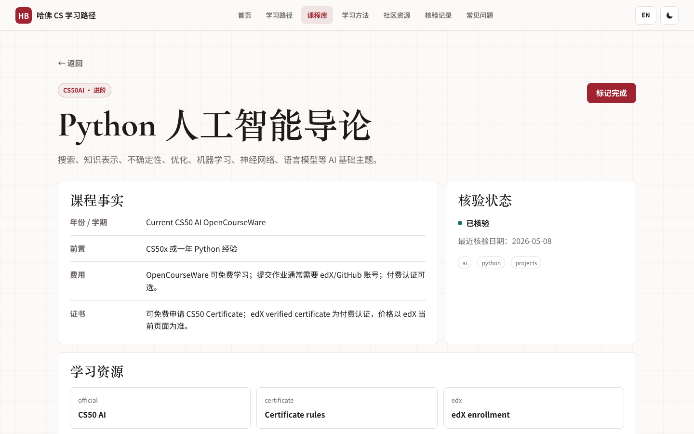
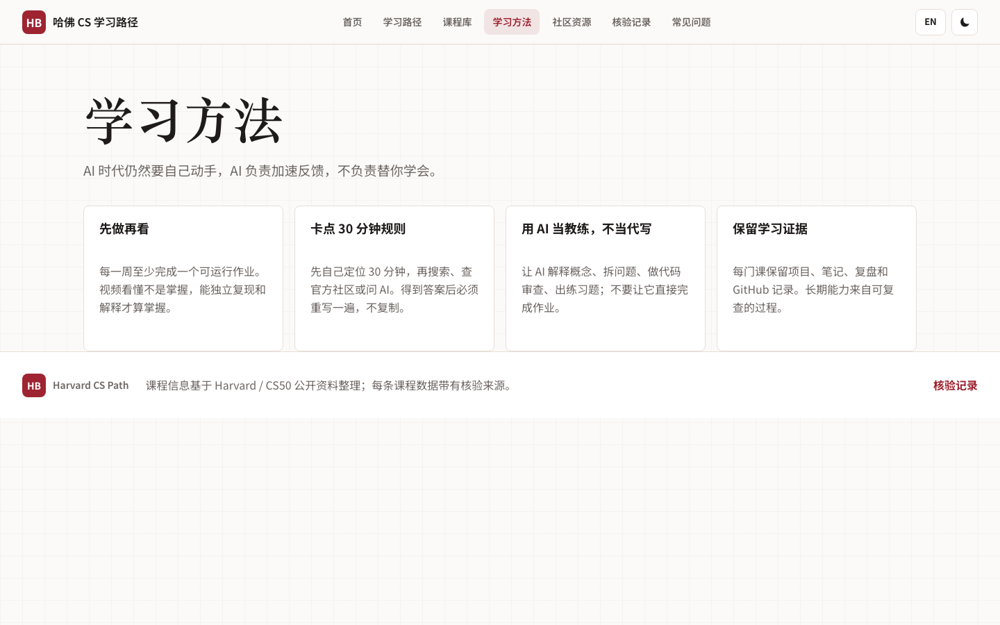
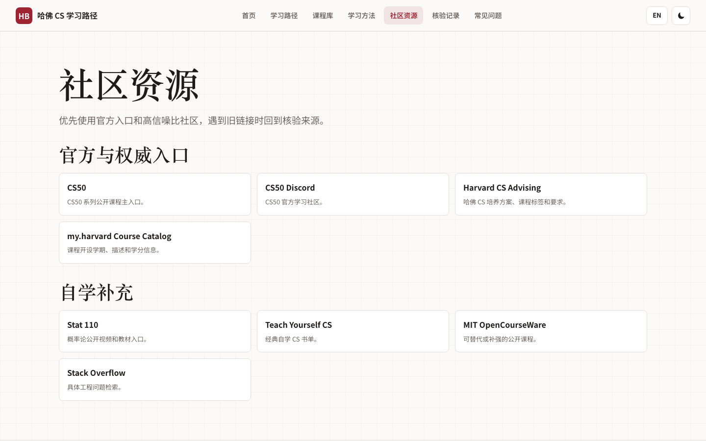
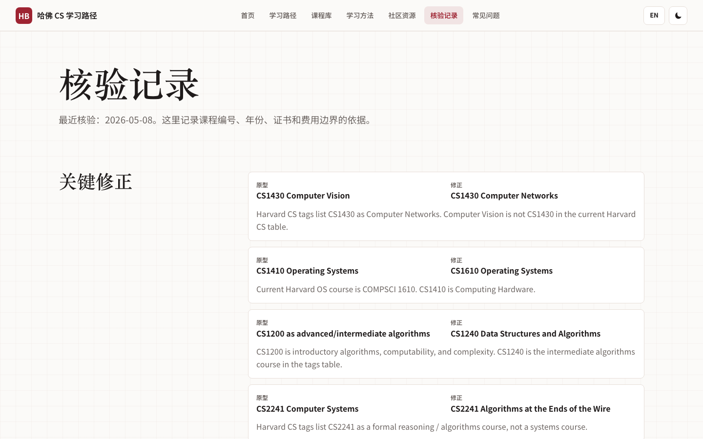
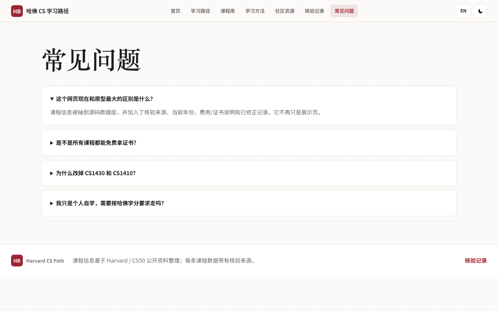

# Harvard CS Path

一个把 Harvard / CS50 公开计算机课程整理成长期自学路径的静态网站。它不是只展示“好看的课程卡片”，而是把课程链接、年份 / 学期、证书、费用边界和核验来源放在同一个工具里，方便持续维护和放心学习。



## 本地运行

```bash
npm run dev
```

打开 `http://127.0.0.1:4173/`。

常用维护命令：

```bash
npm run check
npm run screenshots
```

## 页面导览

### 1. 首页


从首页开始看。这里会先说明这个项目的边界：基于 Harvard CS 培养方案、CS50 OpenCourseWare 和公开课程目录整理，并显示课程数量、学习路径数量、最近核验日期和关键修正数量。第一次访问时，建议直接点“选择我的学习路径”。

### 2. 学习路径



这一页按目标选择路线，而不是让你先面对完整课程库。适合先决定自己当前最需要的是通用 CS 基础、AI 方向、Web 工程，还是系统 / 算法强化。

### 3. 路径详情


路径详情页会把课程拆成阶段，并给出建议学习顺序。每门课都可以继续点进课程详情页，查看入口、年份、证书和费用说明。


AI 路径强调先补 Python、数学和 CS 基础，再进入 CS50 AI、机器学习和项目练习。


Web 路径适合希望做可交付作品的人，先完成编程基础，再进入 Web、数据库和项目实践。


系统路径用于补计算机底层能力，重点看数据结构、算法、操作系统、网络和系统类课程。

### 4. 课程库



课程库适合横向查找。可以按入门、数学、核心、进阶筛选；每张卡片都会显示课程编号、工作量、语言、核验状态和当前年份 / 学期描述。

### 5. 课程详情



课程详情页是这个工具最重要的页面。先看“课程事实”，确认前置要求、费用、证书和年份；再看“学习资源”打开官方入口、证书说明或 edX 页面；最后看“核验来源”，用于追溯信息出处。页面里的学习资源会在当前标签页打开，适合在移动端或微信内浏览器里使用。

### 6. 学习方法



这一页说明怎么把公开课真正学完：先写代码、再看讲解、保留作业记录，用 AI 做反馈和复盘，而不是让 AI 替自己完成学习。

### 7. 社区资源



这里集中放官方入口和高信噪比社区。遇到课程链接漂移时，优先回到官方入口和核验来源，而不是依赖二次搬运链接。

### 8. 核验记录



这一页记录从原型推进到可信工具时做过的关键修正，比如课程编号、课程名称、证书描述和费用边界。后续每次更新课程数据，都应同步更新这里或 `docs/verification.md`。

### 9. 常见问题



FAQ 用来解释常见误解：这个项目不是 Harvard 官方学位计划，证书规则以 CS50 / edX 当前页面为准，学习路径是面向自学目标的重排。

## 工程结构

- `index.html`：静态入口。
- `src/app.js`：无框架 Hash Router 和页面渲染逻辑。
- `src/data.js`：课程、路径、社区、FAQ、核验来源和修正记录。
- `src/styles.css`：页面样式。
- `docs/verification.md`：课程链接、年份、证书 / 费用边界的核验记录。
- `docs/screenshots/`：GitHub README 和页面导览使用的截图。
- `scripts/check-data.mjs`：数据一致性检查。
- `scripts/capture-screenshots.mjs`：本地截图生成脚本，需要先运行 `npm run dev`。

## 维护规则

新增或修改课程时，先改 `src/data.js`，每门课至少保留一个官方来源 URL。然后依次运行：

```bash
npm run check
npm run screenshots
```

如果改动涉及课程编号、年份、证书或费用边界，同步更新 `docs/verification.md`，避免网站重新退回“只好看但不可信”的状态。
