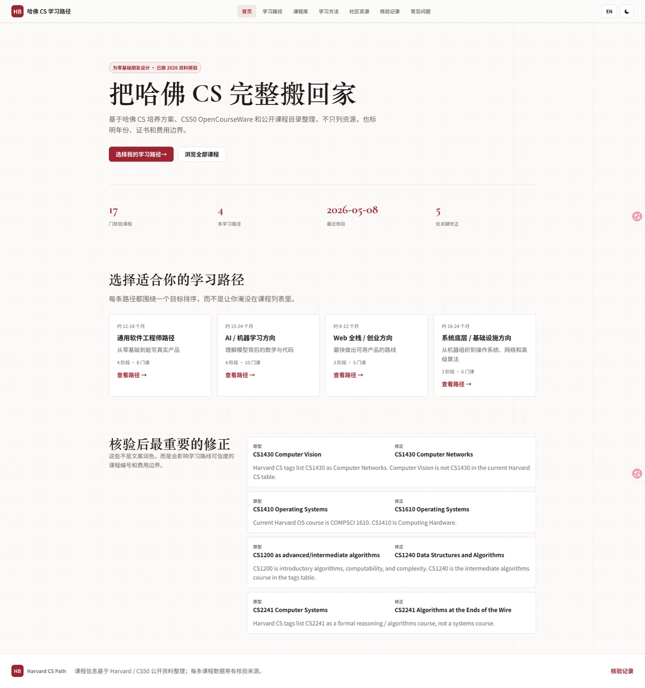
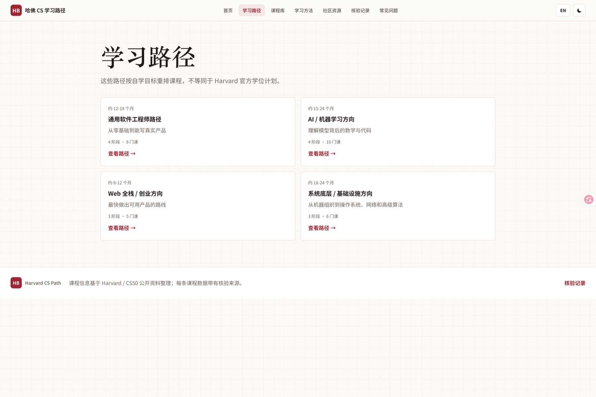
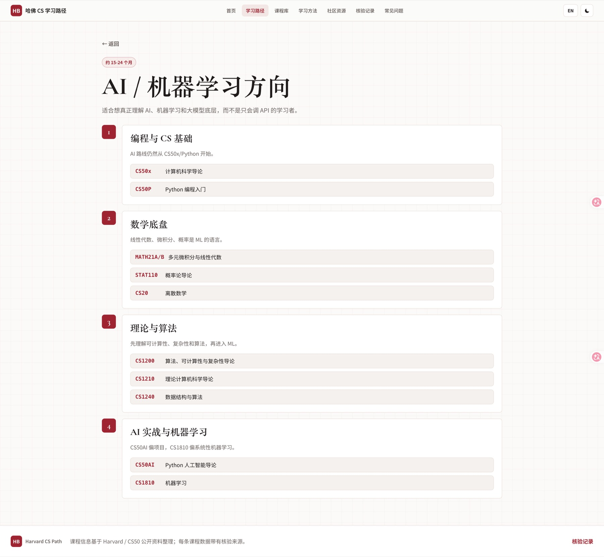
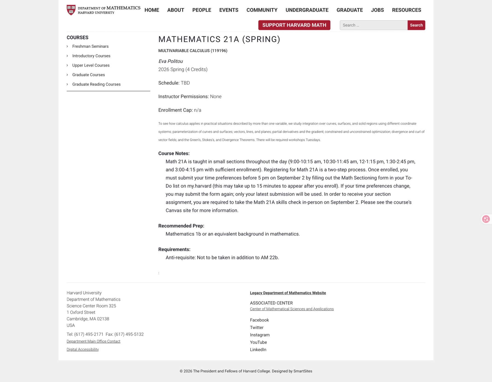

# Harvard CS Path

把 Harvard / CS50 公开计算机课程整理成一套长期自学工具：从零基础入门，到 AI、Web、系统底层和算法方向，都可以按路径学习，并能继续跳转到 Harvard / CS50 / edX 等官方教学页面。

> 非 Harvard 官方项目。它的价值在于把常青藤、世界顶级学府公开出来的 CS 知识资源，整理成更适合普通人长期执行的学习路径。



## 这个项目解决什么问题

网上不缺“哈佛 CS 课程清单”，真正难的是三件事：

- 不知道先学哪门，后学哪门。
- 不知道链接是不是官方、课程编号是不是还对。
- 不知道证书、费用、年份和作业入口到底以哪里为准。

这个网站把这些信息放到同一个地方：每门课都有课程事实、学习资源、证书 / 费用边界和核验来源。你可以把它当作 AI 时代的计算机自学入口，而不是一次性收藏夹。

## 核心优势

1. **围绕 Harvard / CS50 公开资源整理**  
   课程入口优先指向 Harvard、CS50、Harvard Online、my.harvard、Harvard Math / SEAS 等官方页面，减少二手搬运链接的不确定性。

2. **不是课程堆叠，而是学习路径**  
   网站把课程按目标重排成 4 条路径：通用软件工程师、AI / 机器学习、Web 全栈、系统底层 / 基础设施。学习者先选目标，再按阶段推进。

3. **适合 AI 时代重新补计算机基础**  
   AI 可以帮你解释、复盘和加速反馈，但不能替你建立 CS 基础。这个项目强调 Python、数学、数据结构、算法、系统、网络和项目实践。

4. **每门课保留核验来源**  
   网站不只写“推荐课程”，还标明课程年份 / 学期、证书规则、费用边界和官方来源。后续课程页面变化时，可以回到核验记录继续维护。

5. **可以直接跳到 Harvard 教学页面**  
   进入课程详情后，点击“学习资源”里的 `official`、`certificate`、`edx` 等卡片，就能打开对应的 Harvard / CS50 / edX 官方页面。

## 如何使用

### 1. 从首页判断这个工具是否适合你

首页会先告诉你当前收录了多少门核验课程、多少条学习路径、最近一次核验日期，以及做过哪些关键修正。  
如果你是零基础或想系统补 CS，优先点击“选择我的学习路径”。


### 2. 选择一条学习路径

学习路径页不是按课程名堆列表，而是按学习目标组织：

- **通用软件工程师路径**：从零基础到能写真实产品。
- **AI / 机器学习方向**：理解模型背后的数学与代码，而不是只会调用 API。
- **Web 全栈 / 创业方向**：最快做出可用产品的路线。
- **系统底层 / 基础设施方向**：补机器组织、操作系统、网络和高级算法。



### 3. 进入路径详情，按阶段学习

路径详情页会把课程拆成阶段。例如 AI / 机器学习方向会先从 CS50x / CS50P 开始，再补数学、概率、离散数学、算法，最后进入 CS50 AI 和机器学习。  
这样学习的好处是：你不会一上来就被高阶课程劝退，也不会只学工具而跳过基础。



### 4. 点进课程详情，跳转到 Harvard 官方教学页面

每门课都可以继续点进课程详情页。你会看到：

- **课程事实**：年份 / 学期、前置要求、费用、证书规则。
- **学习资源**：官方课程页、证书规则页、edX 报名页或 Harvard 课程目录。
- **核验来源**：用于确认课程编号、课程名称和开课信息。

例如数学基础里的 Math 21A，会跳到 Harvard Department of Mathematics 的课程页面，而不是跳到来路不明的转载页面。



## 可以跳转到哪些官方资源

当前课程库里保留了多类官方入口，例如：

- [CS50x](https://cs50.harvard.edu/x/)：Harvard CS50 计算机科学导论。
- [CS50 Python](https://cs50.harvard.edu/python/)：Python 编程入门。
- [CS50 AI](https://cs50.harvard.edu/ai/)：Python 人工智能导论。
- [CS50 Web](https://cs50.harvard.edu/web/)：Web 编程课程。
- [Harvard CS Advising](https://csadvising.seas.harvard.edu/)：Harvard CS 培养方案、课程标签和要求。
- [Harvard Math 21A](https://www.math.harvard.edu/course/mathematics-21a-spring/)：多元微积分课程页面。
- [my.harvard Course Catalog](https://beta.my.harvard.edu/)：课程开设学期、学分和描述。

## 本地运行

```bash
npm run dev
```

打开 `http://127.0.0.1:4173/`。

常用维护命令：

```bash
npm run check
npm run screenshots
```

## 工程结构

- `index.html`：静态入口。
- `src/app.js`：无框架 Hash Router 和页面渲染逻辑。
- `src/data.js`：课程、路径、社区、FAQ、核验来源和修正记录。
- `src/styles.css`：页面样式。
- `docs/verification.md`：课程链接、年份、证书 / 费用边界的核验记录。
- `docs/screenshots/`：GitHub README 和页面导览使用的截图。
- `scripts/check-data.mjs`：数据一致性检查。
- `scripts/capture-screenshots.mjs`：本地截图生成脚本，需要先运行 `npm run dev`。

## 维护规则

新增或修改课程时，先改 `src/data.js`，每门课至少保留一个官方来源 URL。然后运行：

```bash
npm run check
```

如果改动影响页面展示，再运行：

```bash
npm run screenshots
```

如果改动涉及课程编号、年份、证书或费用边界，同步更新 `docs/verification.md`，避免网站重新退回“只好看但不可信”的状态。
